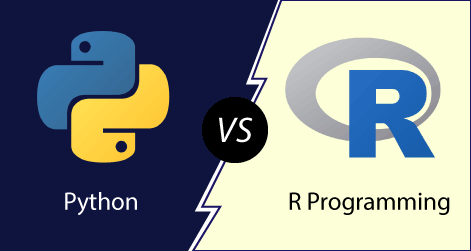

```{r setup, include=FALSE}
knitr::opts_chunk$set(echo = TRUE)
```

# Sobre mim

-   Bacharel em Estatística - UFPR

-   Mestrando no Programa de Pós-Graduação em Métodos Numéricos - UFPR

-   Apaixonado por programação e Aprendizado Estatístico de Máquina

-   CTO e Data Scientist na La Decora

------------------------------------------------------------------------

# R

-   Desenvolvido por Ross Ihaka e Robert Gentleman na Universidade de Auckland, Nova Zelândia, em 1993

-   R 1.0.0 (2000)

-   Inspirado na linguagem S

-   Foco:

    -   Inicialmente voltada para estatística e análise de dados

    -   Amplamente utilizado em estatística, análise exploratória de dados e visualização

-   Comunidade:

    -   Forte presença na comunidade acadêmica e em pesquisas científicas.

    -   Pacotes extensivos desenvolvidos por estatísticos e pesquisadores.

------------------------------------------------------------------------

# Python

-   Criado por Guido van Rossum e lançado em 1991

-   Inicialmente projetado como uma linguagem de propósito geral

-   Foco:

    -   Ampla aplicabilidade, desde desenvolvimento web até automação e análise de dados

    -   Popular para aprendizado de máquina e inteligência artificial

-   Comunidade:

    -   Grande e diversificada comunidade de desenvolvedores

    -   Bibliotecas como NumPy, Pandas e Matplotlib impulsionam a análise de dados.

    -   Com grande suporte para computação em nuvem

------------------------------------------------------------------------

# Qual é o melhor?

<center></center>

------------------------------------------------------------------------

# Imagine que você é um contruto?

<center></center>

------------------------------------------------------------------------

# O melhor dos dois mundos

-   Python é uma **linguagem de propósito geral** de alto nível que se tornou popular em um específico domínio. Com muitas ferramentas para data science e machine learning com bibliotecas como Numpy, Pandas e SciKit-Learn.

-   R foi criada para ser uma linguagem  voltada para estatística e análise de dados mas que vem crescendo como uma linguagem de propósito geral. A Comunidade R vem desenvolvendo muitas ferramentas para fazer deploy em produção.

------------------------------------------------------------------------

# Reticulate - Chamando o Python dentro do R

O reticulate é um pacote do R que realiza uma integração entre sessões do R e Python

- Chama o Python dentro de scripts R. Podendo importar modulos do Python direto para uma sessão R

- Faz a transição entre R e Python objetos (Exemplo: R data frame para pandas data frame)

- Flexibilidade na escolha de versões do Python utilizando virtual environments e Conda environments

------------------------------------------------------------------------

## Hands On!

Primeiro precisamos instalar o pacote

```{r, eval = FALSE}
install.packages('reticulate')
```

Além do pacote `reticulate`, também é necessário instalar o Python.

```{r}
library('reticulate')
```

------------------------------------------------------------------------

### Main functions

-   `reticulate::repl_python()` - Abrir um python repl dentro do R console

-   `reticulate::import()` - Importar o modulo Python para o R

-   `reticulate::py_install()` - Instalar python modules

-   `reticulate::source_python()` - Executar um Python script dentro do R

-   `r.` e `py$` para acessar as variáveis

------------------------------------------------------------------------

O pacote faz automaticamente a conversão:

Single-element vector $\rightarrow$ Scalar

Multi-element vector $\rightarrow$ List

List of multiple types $\rightarrow$ Tuple

Named list $\rightarrow$ Dict

Matrix/Array $\rightarrow$ NumPy ndarray

Data Frame $\rightarrow$ Pandas DataFrame

Function $\rightarrow$ Python function

NULL, TRUE, FALSE $\rightarrow$ None, True, False

------------------------------------------------------------------------

```{python}
def converter(x):
  print(x)
  return x

```

```{r}
py$converter(FALSE)
py$converter(c(1,2,3))
py$converter(list(1L, TRUE, "foo"))
py$converter(matrix(c(1,2,3,4), nrow = 2, ncol = 2))
py$converter(data.frame(x = c(1,2,3), y = c("a", "b", "c")))
```

------------------------------------------------------------------------

## Fazendo importação de um modulo Python

A função `import` pode ser usada para importar funções do Python para o R.

```{r}
os <- import("os")
os$listdir(".")
```

------------------------------------------------------------------------

## Executar um Python script dentro do R

```{r}
source_python("teste.py")
```

------------------------------------------------------------------------

## Sharks data

Vamos dar uma olhada na base sharks

```{python}
import pandas as pd
import numpy as np

sharks = pd.read_excel("GSAF5.xls")
sharks.columns
```

Modificando o nome das colunas

```{r}
library(tidyverse)

py$sharks <- py$sharks %>% 
  janitor::clean_names() %>% 
  unique() %>% 
  filter(!is.na("Case Number"))
```

```{python}
sharks = sharks \
.rename(columns={'unnamed_11': 'fatal_y_n'})
sharks.columns
```

```{python}
sharks = sharks.filter(
  ['case_number', 'country', 'activity', 'fatal_y_n']
  ).query(
  'country in ["USA", "AUSTRALIA"] & activity == "Surfing"'
  ).replace(to_replace='None', value=np.nan).dropna()
```

```{python}
sharks = sharks.assign(
  fatal_y_n = lambda x: x.fatal_y_n == 'Y'
)
```

------------------------------------------------------------------------

```{r}
library(gt)
py$sharks %>% 
  gt() %>% 
  tab_header(
    title = "Data frame limpo"
  )
```

```{r}
py$sharks %>% 
  mutate_all(unlist) %>% 
  ggplot(
    aes(x = country, fill = fatal_y_n)
  ) + 
    geom_bar(
      position = 'fill'
    )

```

# R2Py - Chamando o R dentro do Python

-   Agora vamos utilizar o R dentro de um script Python

-   Para instalar o pacote podemos utilizar o comando

```         
pip3 install rpy2
```

```{python}
import rpy2
import rpy2.situation
import rpy2.robjects as ro
from rpy2.robjects import pandas2ri
import pandas as pd
from rpy2.robjects import r


pandas2ri.activate()
```

Agora, vamos importar pacotes do R para dentro do Python.

```{python}
from rpy2.robjects.packages import importr
import rpy2.robjects.packages as pkgs

r_base = importr('base') 
r_utils = importr('utils')
```

## Instalando e importando pacotes

```{python}
# r_utils.install_packages("fortunes")
ftns = pkgs.importr("fortunes")
ftn7 = ftns.fortune(7)
print(ftn7)
```

## Exemplo airline

```{python}
df = pd.read_csv("airline-passengers.csv")
df.head()
```

## Converter dados para o formato R:

```{python}
rdf = pandas2ri.py2rpy(df)
```

```{python}
r_base.mean(rdf[1])
```

# Criando funções no R e utilizando no Python

```{python}
soma = r("""
function(x, y){
  return(x + y)
}
""")

x = soma(1, 2)
x
```

# Conclusão

-   A integração entre Python e R amplia as possibilidades de análise de dados e estatísticas

-   Ambas as linguagens têm vantagens distintas, e a escolha depende do contexto e dos objetivos

-   Ferramentas como Reticulate e R2Py facilitam essa integração, proporcionando uma abordagem mais holística
